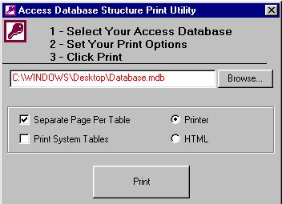



## AccessStructurePrinter

### Description

This code takes a user specified Access Database (I used Access 2000) and prints the database structure to a printer or to an HTML file. Currently working on adding Queries, etc. to the mix as well (Version 2.0!!) if i get any feedback.
 
### More Info
 
An Access Database

Shows extensive use of simple print statements, the MS Common Dialog control, Database, recordset, TableDef, Field, and Index Objects.

Printer Data or HTML Formatted File

             |
---                |---
**Submitted On**   |2002-03-17 21:36:04
**By**             |[Joe Surls](https://github.com/Planet-Source-Code/PSCIndex/blob/master/ByAuthor/joe-surls.md)
**Level**          |Intermediate
**User Rating**    |4.7 (61 globes from 13 users)
**Compatibility**  |VB 6\.0
**Category**       |[Databases/ Data Access/ DAO/ ADO](https://github.com/Planet-Source-Code/PSCIndex/blob/master/ByCategory/databases-data-access-dao-ado__1-6.md)
**World**          |[Visual Basic](https://github.com/Planet-Source-Code/PSCIndex/blob/master/ByWorld/visual-basic.md)
**Archive File**   |[AccessStru631923182002\.zip](https://github.com/Planet-Source-Code/joe-surls-accessstructureprinter__1-32795/archive/master.zip)

